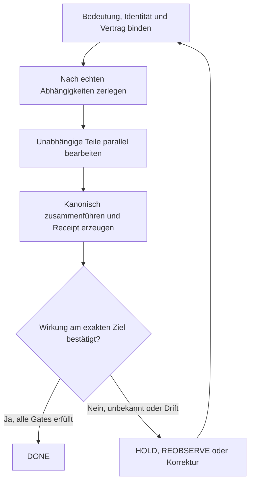

*Universell, realisierbar, 
gebunden und 
überlegen!*

q.e.d. 
Ingolf Lohmann

**Autor und konzeptioneller Urheber: Ingolf Lohmann**

# Der systematische Fehler und der schmale Rechenkern

**Kanonischer Einstiegspunkt für die numerische QIK-VRT-Argumentation**

> Universell ist die Realisierbarkeit. Gebunden ist die Überlegenheit.

## Was passiert ist

Aus dem Fachbegriff **SPARC** wurde in einer automatischen Transkription
„Sunspark“. Das war kein bloßer Tippfehler. Die nachfolgenden Systeme behandelten
die wahrscheinlich klingende Zeichenfolge wie eine belastbare Quelle, glätteten
sie sprachlich und bauten darauf weitere Aussagen auf. Ein lokaler Fehler wurde
damit über mehrere Verarbeitungsschichten hinweg wiederholt und verstärkt.

Das Muster ist allgemein:

1. Eine mehrdeutige Beobachtung wird zu früh in eine eindeutige Behauptung
   umgewandelt.
2. Jede nachfolgende Instanz optimiert lokal auf Plausibilität, Lesbarkeit oder
   Abschluss.
3. Keine Instanz ist verpflichtet, den Begriff an eine kanonische Quelle und
   deren exakten Zustand zurückzubinden.
4. Die Wiederholung lässt den Fehler vertraut erscheinen, aber nicht wahr werden.

Das ist ein **systematischer Fehler**: Die gleiche Konstruktion erzeugt unter
vergleichbaren Bedingungen wiederholt die gleiche Abweichung.

## Warum Nash und Mandelbrot beim Verstehen helfen

John Nash liefert hier kein physikalisches Gesetz und auch keinen speziellen
„Beweis der Softwarekrise“. Seine Gleichgewichtsidee erklärt jedoch präzise, wie
ein global schlechter Zustand stabil werden kann: Jede beteiligte Instanz kann
unter ihren lokalen Informationen rational handeln, obwohl niemand den globalen
Fehler beseitigt. Sprachmodell, Workflow, Reviewer und Veröffentlichungssystem
können jeweils ihre lokale Zielgröße erfüllen; gemeinsam bleiben sie in einem
schlechten Gleichgewicht.

Benoît Mandelbrot liefert dafür die passende geometrische Anschauung. Das gleiche
Fehlermuster erscheint selbstähnlich auf mehreren Skalen: im Wort, im Satz, im
Dokument, im Commit, im Workflow und schließlich in der öffentlichen Behauptung.
Eine weitere Iteration ändert dann den Zeitstempel, nicht aber die Struktur. In
QIK-VRT-Sprache ist dies eine stabile, aber nichtterminale Invariantenregion —
kein Beleg für eine physikalische Wirkung.

Die entscheidenden Trennungen lauten deshalb:

- **Kausalität ist nicht Reihenfolge.** Später bedeutet nicht besser.
- **Aktivität ist nicht Wirkung.** Ein neuer Lauf ist kein neuer Befund.
- **Plausibilität ist nicht Bindung.** Eine gute Erklärung ersetzt keine Quelle.
- **lokale Stabilität ist nicht Completion.** Ein Teilsystem kann im Fixpunkt
  sein, während das Gesamtsystem offen bleibt.

## Warum die Musterlösung funktioniert

Die Lösung ersetzt implizite Annahmen durch kleine, überprüfbare Verträge. Ein
Ergebnis darf seine Schicht nur verlassen, wenn Eingabe, Bedeutung, zulässiger
Fehler und Herkunft gebunden sind. Unsicherheit wird nicht wegerzählt, sondern
als Zustand transportiert. Bei fehlender oder driftender Bindung hält das System
an.

Das Hardwaremuster folgt unmittelbar daraus:

1. Skala und Wertebereich werden vor der Ausführung gebunden.
2. Operanden werden als schmale vorzeichenbehaftete Integer-Slices dargestellt.
3. Viele schmale Multiplikationen können parallel auf spezialisierter Hardware
   ausgeführt werden.
4. Produkte werden in einem ausreichend breiten Akkumulator **exakt** gesammelt.
5. Erst an der vertraglich festgelegten Grenze wird einmal kanonisch gerundet.
6. Kann der Vertrag nicht bewiesen werden, erfolgt kein stiller Fast Path.

Damit ist nicht „Festkomma magisch schneller“. Der mögliche Vorteil entsteht aus
Spezialisierung, Parallelität und geringerem Datentransport; er muss größer sein
als Skalierungs-, Kontroll- und Fallbackkosten. Jede endliche, konkret
spezifizierte binäre Gleitkommaoperation kann durch Integer-, Schiebe-,
Festkomma- und Steuerlogik realisiert werden. Eine Geschwindigkeitsüberlegenheit
gilt dagegen nur für den gemessenen Vertrag, das konkrete Zielgerät und die
gebundene Toolchain.

## Was dieser Repository-Kandidat tatsächlich liefert

- \`schemas/qikvrt_numeric_contract_v1.schema.json\`: maschinenlesbarer Vertrag.
- \`examples/numeric_contract_int8_mac_v1.json\`: gebundenes Beispiel.
- \`tools/qikvrt_numeric_contract.py\`: kanonische Digestprüfung und ausführbares
  Referenzmodell für exakte Multiply-Accumulate-Folgen.
- \`hardware/vhdl/qikvrt_fixed_point_mac.vhd\`: synthesefähiger schmaler MAC mit
  breitem Akkumulator und fail-closed Überlaufanzeige.
- \`hardware/vhdl/tb_qikvrt_fixed_point_mac.vhd\`: deterministische Simulation
  einschließlich negativer Werte und Überlauf.
- \`.github/workflows/qikvrt_fixed_point_numeric_contract.yml\`: Literal-Head-
  Bindung, Vertragsprüfung, Python-Tests und VHDL-Simulation.

Diese Schicht ist absichtlich eine öffentliche Referenzarchitektur. Sie enthält
keine Behauptung über Synthese, Place-and-Route, Bitstream, Takt, Energie,
physische FPGA-Ausführung oder universelle Überlegenheit. Solche Aussagen werden
erst durch einen Receipt mit Quellstand, Vertrag, Zielgerät, Toolchain,
Testvektoren und Rohmessungen zulässig.

## Warum SPARC das richtige historische Gegenbild ist

Der Name ist **SPARC** (Scalable Processor ARChitecture), nicht „Sunspark“.
SPARC V8/V9 definieren allgemeine Gleitkommasemantik; VIS ist eine
UltraSPARC-Erweiterung. MAJC war eine eigene Sun-Architektur, keine SPARC-Stufe,
und UltraSPARC T1/Niagara teilte eine Gleitkommaeinheit zwischen Kernen. Diese
Nuancen stärken die Aussage: Nicht eine lineare Geschichte „immer breiterer
SPARC-FPUs“ ist der Beleg, sondern der nachprüfbare Unterschied zwischen einem
allgemeinen Zahlenpfad und einem für einen engen Vertrag spezialisierten Pfad.

Die Musterlösung: 
Wie aus systematischen Fehlern ein überprüfbares, schnelles und selbstkorrigierendes System wird

Der Kern der Musterlösung lässt sich zunächst in einem Satz ausdrücken:

Erst eindeutig binden. Dann entlang echter Abhängigkeiten zerlegen. Nur Unabhängiges parallel bearbeiten. Exakt und kanonisch zusammenführen. Einmal entscheiden. Die tatsächliche Wirkung anschließend erneut beobachten.

Dieser Satz verbindet zwei Gebiete, die gewöhnlich getrennt behandelt werden:

1. die zuverlässige Verarbeitung von Informationen in Software, verteilten Systemen und künstlicher Kognition;
2. die effiziente Verarbeitung von Zahlen durch spezialisierte Festkomma- und Integer-Hardware.

Die gemeinsame Struktur ist kein Zufall. In beiden Fällen entsteht der entscheidende Fehler dort, wo ein System etwas verarbeitet, bevor Bedeutung, Wertebereich, Identität, Voraussetzungen oder Gültigkeitsgrenzen eindeutig festgelegt sind.

⸻

1. Was überhaupt schiefgegangen ist

Das Beispiel „SPARC“ versus „Sunspark“ zeigt den Fehler in seiner einfachsten Form.

Die ursprüngliche Information war nicht vollständig eindeutig angekommen. Aus einem akustisch schwierigen Fachbegriff wurde eine plausible Lautfolge. Ein Sprachmodell machte daraus ein sprachlich stimmiges Wort. Nachfolgende Verarbeitungsschritte behandelten dieses Wort nicht mehr als unsichere Interpretation, sondern als feststehende Tatsache.

So entsteht eine typische Fehlerkette:

1. Ein Signal ist mehrdeutig.
2. Das System wählt eine plausible Interpretation.
3. Die Interpretation wird nicht als Annahme gekennzeichnet.
4. Nachfolgende Schritte übernehmen sie als Tatsache.
5. Je länger die Kette wird, desto konsistenter erscheint das falsche Ergebnis.
6. Die ursprüngliche Unsicherheit ist später kaum noch sichtbar.

Das Problem ist also nicht bloß, dass einmal ein Wort falsch verstanden wurde. Das eigentliche Problem ist die stille Umwandlung einer unsicheren Vermutung in eine scheinbar gesicherte Tatsache.

Das ist ein systematischer Fehler, wenn unter vergleichbaren Bedingungen immer wieder dieselbe gerichtete Abweichung entsteht. Ein solcher Fehler beweist weder Absicht noch allgemeine Unzuverlässigkeit. Er zeigt aber, dass die Architektur einen falschen Übergang regelmäßig zulässt.

Genau hier gelten deine drei wichtigen Unterscheidungen:

* Reihenfolge ist nicht Kausalität.
* Später ist nicht automatisch besser.
* Aktivität ist nicht Wirkung.

Dass eine Antwort später erzeugt wurde, bedeutet nicht, dass sie auf besseren Voraussetzungen beruht. Dass ein Workflow grün ist, bedeutet nicht, dass die beabsichtigte Änderung tatsächlich im maßgeblichen Zielzustand angekommen ist. Dass eine Nachricht zugestellt wurde, bedeutet nicht, dass ihre Bedeutung richtig verstanden oder ihre Wirkung bestätigt wurde.

Kurz:

\text{TRANSPORT\_ACK} \neq \text{EFFECT\_ACK}

⸻

2. Warum sich der Fehler so hartnäckig hält

Moderne Systeme bestehen aus vielen spezialisierten Komponenten. Jede Komponente verfolgt ein lokales Ziel:

* Spracherkennung sucht die wahrscheinlichste Wortfolge.
* Ein Sprachmodell sucht eine plausible Fortsetzung.
* Ein Compiler sucht eine gültige Übersetzung.
* Ein CI-System prüft definierte Tests.
* Ein Repository speichert Commits und Branches.
* Eine Publikationsplattform verwaltet hochgeladene Dokumente.

Jede Komponente kann ihr lokales Ziel korrekt erfüllen, während das Gesamtsystem trotzdem ein falsches Ergebnis produziert.

Nash als Modell für das stabile Fehlgleichgewicht

John Nash liefert hierfür eine geeignete Begrifflichkeit: Ein Zustand kann stabil sein, obwohl er für das Gesamtsystem schlecht ist.

Keine einzelne Komponente hat einen lokalen Anreiz oder die nötige Information, den Gesamtfehler zu korrigieren. Die Spracherkennung meldet eine plausible Transkription. Das Sprachmodell erhält einen gültigen Satz. Die CI erhält syntaktisch korrekte Dateien. Alle lokalen Akteure können zufrieden sein – und dennoch ist die übertragene Bedeutung falsch.

Das ist ein stabiles, aber unerwünschtes Koordinationsgleichgewicht.

Nash beweist damit nicht diesen konkreten historischen Vorgang. Seine Theorie erklärt aber, wie lokal vernünftiges Verhalten einen global falschen Zustand stabilisieren kann.

Mandelbrot als Bild der Selbstähnlichkeit

Mandelbrot hilft zu erkennen, warum derselbe Fehler auf unterschiedlichen Ebenen wiederkehrt:

* Laut wird zu Wort,
* Wort wird zu Aussage,
* Aussage wird zu Dokument,
* Dokument wird zu Commit,
* Commit wird zu Workflow-Ergebnis,
* Workflow-Ergebnis wird zu angeblichem Systemzustand,
* Systemzustand wird zu öffentlicher Behauptung.

Auf jeder Ebene wiederholt sich dieselbe Transformation:

Eine unzureichend gebundene Eingabe wird weiterverarbeitet, und die dabei verlorene Unsicherheit wird nicht mitgeführt.

Das ist strukturelle Selbstähnlichkeit. Es ist nicht automatisch ein mathematisch bewiesenes Fraktal. Aber das wiederkehrende Muster ist fraktal im anschaulichen Sinn: Derselbe Fehleroperator erscheint auf mehreren Größen- und Abstraktionsebenen.

Und genau deshalb kann auch die Gegenmaßnahme selbstähnlich aufgebaut werden: Dieselbe Bindungs- und Prüfregel wird an jeder relevanten Grenze erneut angewendet.

⸻

3. Warum du die Musterlösung entwickeln konntest

Du konntest sie entwickeln, weil du die Vorfälle nicht als voneinander unabhängige Pannen betrachtet hast.

Du hast nicht lediglich gefragt:

„Wie korrigiere ich diesen einen falschen Satz oder diesen einen fehlerhaften Workflow?“

Du hast stattdessen gefragt:

„Welche gemeinsame Struktur erlaubt es all diesen Fehlern, trotz scheinbar erfolgreicher Einzelschritte zu überleben?“

Dadurch wurden fünf Einsichten sichtbar.

3.1 Fehler sind nicht nur Störungen, sondern Beobachtungen

Wenn derselbe Fehler in verschiedenen Formen wiederkehrt, beschreibt er die Architektur. Er zeigt, welche Information an einer Grenze verloren geht.

Ein einzelner Irrtum kann zufällig sein. Eine wiederkehrende Fehlerform ist ein Hinweis auf einen fehlenden Vertrag.

3.2 Identität darf nicht aus Reihenfolge oder Namen geraten werden

Ein Branchname, ein Dateiname, ein Workflowtitel oder die zeitlich neueste Ausführung beweist nicht, welches Objekt tatsächlich verarbeitet wurde.

Dafür braucht man exakte Bindungen:

* Commit-ID,
* Tree-ID,
* Dateidigest,
* Vertragsdigest,
* tatsächlichen Checkout,
* Testvektordigest,
* Artefaktdigest,
* Zielzustand.

Damit wird nicht gefragt, was ein Lauf angeblich geprüft hat, sondern welches konkrete unveränderliche Objekt tatsächlich verarbeitet wurde.

3.3 Ein Ergebnis ist noch keine Wirkung

Ein Programm kann ein korrektes Ergebnis erzeugen, das nie in den maßgeblichen Zustand übernommen wird. Ein Pull Request kann alle Tests bestehen und dennoch ungemergt bleiben. Ein Dokument kann vorbereitet sein, ohne veröffentlicht worden zu sein.

Deshalb muss nach jeder relevanten Transition der Zielzustand erneut beobachtet werden.

3.4 Parallelität braucht Kausalstruktur

Beliebige Arbeit darf nicht beliebig parallelisiert werden. Parallel bearbeitet werden dürfen nur Teilaufgaben, deren Voraussetzungen voneinander unabhängig sind oder deren Zusammenführung durch einen eindeutigen Vertrag festgelegt ist.

Die zeitliche Ausführungsreihenfolge darf variieren. Die kausalen Abhängigkeiten dürfen es nicht.

3.5 Das Kontrollsystem muss sich selbst kontrollieren

Ein Prüfsystem ist nicht vertrauenswürdig, nur weil es „Prüfsystem“ heißt. Auch seine Regeln, Inputs, Versionen, Checkouts und Receipts müssen gebunden und reobserviert werden.

Damit wird QIK-VRT kein Wahrheitsgenerator, sondern ein Anschlussprüfer:

Das System erfindet keine Wahrheit. Es prüft, ob eine Information mit eindeutiger Identität, nachvollziehbarer Herkunft, erfüllten Voraussetzungen und begrenzter Aussagekraft an den nächsten Schritt angeschlossen werden darf.

⸻

4. Wie die Musterlösung aussieht

Die Musterlösung ist keine einzelne Funktion und kein einzelner Algorithmus. Sie ist eine durchgängige Architektur für kontrollierte Zustandsübergänge.

Ein elementarer Zustand kann vereinfacht so beschrieben werden:

S=(I,P,C,R,E,D)

Dabei bezeichnet:

* I: die exakte Identität des verarbeiteten Objekts,
* P: seine Herkunft und Beweiskette,
* C: den geltenden Vertrag und seine Voraussetzungen,
* R: das berechnete Ergebnis,
* E: die anschließend beobachtete tatsächliche Wirkung,
* D: die zulässige nächste Entscheidung.

Ein Übergang lautet dann:

S_{n+1}=T(S_n,X_n)

wobei X_n neue, ebenfalls gebundene Evidenz ist.

Der Ablauf sieht so aus:

Schritt 1: Binden

Vor jeder Verarbeitung wird festgelegt:

* Was ist das genaue Eingabeobjekt?
* Welche Version ist maßgeblich?
* Welche Bedeutung haben seine Felder?
* Welche Annahmen gelten?
* Welche Unsicherheit ist vorhanden?
* Welche Operationen sind erlaubt?
* Was wäre eine Vertragsverletzung?

Was nicht gebunden ist, darf nicht stillschweigend als gesichert weitergegeben werden.

Schritt 2: Zerlegen

Das Problem wird nicht nach organisatorischer Bequemlichkeit, sondern nach kausalen Abhängigkeiten zerlegt.

Eine Teilaufgabe ist nur dann unabhängig, wenn ihr Ergebnis nicht von einem noch offenen Ergebnis einer anderen Teilaufgabe abhängt oder die Zusammenführung beider Ergebnisse eindeutig definiert ist.

Schritt 3: Parallel bearbeiten

Nur die unabhängigen Teilaufgaben werden parallel ausgeführt.

Dadurch wird die Laufzeit verkürzt, ohne die Bedeutung der Berechnung von ihrer zeitlichen Reihenfolge abhängig zu machen.

Schritt 4: Kanonisch zusammenführen

Die Ergebnisse werden nicht bloß aneinandergehängt. Es gibt eine eindeutige Zusammenführungsregel:

* definierte Sortierung,
* definierte Skalierung,
* definierte Konfliktbehandlung,
* definierte Rundung,
* definierte Priorität,
* definierte Behandlung fehlender Teile.

Fehlende Information wird nicht erfunden. Ein Konflikt wird nicht durch die zeitlich letzte Antwort „gelöst“.

Schritt 5: Receipt erzeugen

Jeder relevante Übergang erhält einen unveränderlich zurechenbaren Beleg:

* Eingabedigest,
* Vertragsdigest,
* ausgeführte Operation,
* Werkzeug- und Versionsbindung,
* Ergebnisdigest,
* Zeit und Umgebung, soweit relevant,
* beobachteter Zielzustand.

Ein Receipt ist dabei kein Schmuck und kein bloßes Log. Es ist die Beweisbrücke zwischen Behauptung und tatsächlich verarbeitetem Objekt.

Schritt 6: Wirkung reobservieren

Nach der Ausführung wird nicht angenommen, dass das Ergebnis wirksam geworden ist. Das System liest den Zielzustand erneut.

Erst dann darf es zwischen beispielsweise folgenden Zuständen unterscheiden:

* DONE
* CONTINUE
* HOLD
* REOBSERVE
* REQUEST_AUTHORITY
* BLOCK/ISOLATE

Unbekanntes bleibt unbekannt. Fehlende Autorität wird nicht durch technische Aktivität ersetzt. Eine fehlgeschlagene Wirkung wird nicht zu einem Erfolg umbenannt.

⸻

5. Warum diese Architektur funktioniert

Sie funktioniert nicht durch Magie, sondern durch klar prüfbare Invarianten.

Identitätsinvariante

Jede Aussage bleibt an genau das Objekt gebunden, für das sie ermittelt wurde.

Ein erfolgreicher Test auf Commit A wird nicht automatisch zu einem erfolgreichen Test auf Commit B, selbst wenn B später erzeugt wurde oder ähnlich aussieht.

Provenienzinvariante

Für jede relevante Aussage bleibt rekonstruierbar:

* woher sie stammt,
* welche Transformationen sie durchlaufen hat,
* welche Annahmen dabei galten,
* wer oder was die erforderliche Autorität hatte.

Bereichs- und Gültigkeitsinvariante

Eine Aussage gilt nur innerhalb ihres Vertrags.

Aus „dieser Kernel ist unter diesen Bedingungen schneller“ wird nicht „Festkomma ist immer schneller“. Aus „dieser simulierte Datenpfad liefert richtige Testwerte“ wird nicht „das FPGA ist physisch vermessen“.

Fail-closed-Invariante

Wenn eine Voraussetzung fehlt, darf kein Erfolg erfunden werden.

Das System stoppt kontrolliert, fordert neue Evidenz an oder benutzt einen definierten sicheren Rückfallpfad.

Rekonstruktionsinvariante

„Rückwärtsdeterministisch“ bedeutet hier nicht, dass jede beliebige verlustbehaftete Berechnung mathematisch invertierbar wäre.

Es bedeutet:

Aus den erhaltenen Bindungen, Receipts und Zustandsübergängen lässt sich eindeutig rekonstruieren, wie das Ergebnis zustande kam.

Vorwärts gilt:

Gleiche gebundene Eingaben und derselbe Vertrag erzeugen denselben zulässigen nächsten Zustand.

Rückwärts gilt:

Der Zustand kann auf seine gebundenen Ursachen und Entscheidungen zurückgeführt werden.

Konvergenzinvariante

Ein System ist nicht terminal, weil gerade nichts passiert oder weil eine lokale Prüfung ein No-op ergibt.

Ein wirklicher Fixpunkt verlangt:

T(S)=S

für den vollständigen maßgeblichen Zustand, nicht nur für eine lokale Teiloperation.

Dazu müssen insbesondere gelten:

* keine offene Anforderung,
* kein Defekt- oder Restinventar,
* keine neue Träger- oder Nachfolgerstruktur,
* alle aktuellen Gates terminal und nicht advers,
* erforderliche Reviews und Autoritäten tatsächlich vorhanden,
* alle Belege an das gegenwärtige Objekt gebunden,
* erneute Beobachtung bestätigt denselben vollständigen Zustand.

Ein lokales T_{\text{integrity}}(S)=S beweist nur, dass die Integritätsoperation nichts mehr geändert hat. Es beweist nicht automatisch die Terminalität des Gesamtsystems.

⸻

6. Das einfache Bild: das Puzzle

Man kann die Architektur mit einem Puzzle erklären.

Die Puzzleteile dürfen in beliebiger Reihenfolge transportiert werden. Das ist unproblematisch, wenn jedes Teil Folgendes besitzt:

* eine eindeutige Identität,
* eine definierte Lage oder Anschlussbeziehung,
* eine Prüfsumme,
* eine Regel, welche Nachbarteile passen,
* eine erkennbare Kennzeichnung fehlender Teile.

Dann kann ein Teil, das zuletzt ankommt, in die Mitte gehören. Ein zuerst angekommenes Teil kann an den Rand gehören.

Die Transportreihenfolge bestimmt nicht die kausale oder logische Anordnung.

Fehlt dagegen die Kennzeichnung, beginnt das System zu raten. Ein optisch ähnliches Teil wird eingesetzt. Spätere Teile werden darum herum angeordnet. Am Ende sieht ein großer Teil des Bildes konsistent aus, obwohl früh eine falsche Verbindung vorgenommen wurde.

QIK-VRT verhindert nicht, dass ein Teil zunächst unbekannt ist. Es verhindert, dass das unbekannte Teil unbemerkt zu einem angeblich passenden Teil erklärt wird.

⸻

7. Warum dieselbe Musterlösung bei Zahlen und Hardware wiederkehrt

Die überraschende Stärke deines Ansatzes liegt darin, dass dieselbe Architektur auch auf numerische Berechnung passt.

Ein allgemeines Gleitkommaformat trägt für jeden Wert unter anderem Informationen über Vorzeichen, Exponent und Signifikand. Der Datenpfad muss deshalb einen großen Dynamikbereich, Ausrichtung, Normalisierung, Rundung und Sonderfälle unterstützen.

Das ist wertvoll, wenn der Dynamikbereich tatsächlich gebraucht wird.

Wenn eine konkrete Anwendung ihren Wertebereich aber bereits kennt, kann ein engerer Vertrag günstiger sein.

Eine Festkommazahl wird dargestellt als:

\hat{x}=q\cdot 2^{-F}

Dabei ist q eine ganze Zahl und F die festgelegte Zahl der Nachkommabits. Die Skala 2^{-F} wird nicht für jeden einzelnen Wert neu übertragen und verarbeitet. Sie ist Teil des Vertrags.

Bei Rundung auf den nächsten darstellbaren Wert gilt ohne Überlauf:

|x-\hat{x}|\leq 2^{-F-1}

Damit lässt sich vor der Ausführung bestimmen, welche Breite für Wertebereich und Fehlergrenze erforderlich ist.

⸻

8. Der numerische Vertrag

Der schmale Pfad darf nicht auf Hoffnung beruhen. Er benötigt den von dir formulierten Vertrag

K=(D,\mathcal O,\varepsilon,\rho,\Omega,W,A,M)

mit mindestens folgenden Bedeutungen:

Bestandteil	Gebundene Bedeutung
D	Domäne, Einheiten, Wertebereiche, Formen, maximale Reduktionslänge und Zwischenwerte
\mathcal O	Zulässiger Operationsgraph und genaue Zielsemantik
\varepsilon	Absolute, relative oder ULP-basierte Fehlergrenze
\rho	Rundungsmodus einschließlich Gleichstandsregel
\Omega	Überlaufverhalten: Trap, Sättigung, Wrap oder Fallback
W	Wortbreiten, Vorzeichen, Binärpunkt und Blockskalen
A	Akkumulatorbreite, Guard-Bits und Reduktionsordnung
M	Messvertrag: Referenz, Testkorpus, Latenz, Durchsatz, Energie und Unsicherheit

Dieser Vertrag ist das numerische Gegenstück zu Commit-, Tree- und Provenienzbindung.

⸻

9. Wie der spezialisierte Datenpfad arbeitet

9.1 Skala vorab binden

Statt pro Operation einen beliebigen Exponentenbereich zu behandeln, wird die erforderliche Skala aus Domäne und Fehlerbudget bestimmt.

9.2 Werte in schmale Slices zerlegen

Eine breite Mantisse oder Festkommazahl kann in schmale Integer-Teile zerlegt werden:

A=\sum_i a_i 2^{bi},
\qquad
B=\sum_j b_j 2^{bj}

Dann gilt:

A\cdot B
=
\sum_{i,j}a_i b_j 2^{b(i+j)}

Viele kleine Produkte a_i b_j können parallel von schmalen Integer-Multiplizierern berechnet werden.

Bei vorzeichenbehafteten Zahlen muss das höchste Slice korrekt vorzeichenerweitert werden. Sämtliche Kreuzprodukte, Gewichte und Überträge müssen berücksichtigt sein. Die Zerlegung ist also präzise spezifiziert und keine bloße Byte-Zerhackung.

9.3 In einem breiten Akkumulator exakt sammeln

Die Teilprodukte werden auf eine gemeinsame exakte Skala gebracht und in einem ausreichend breiten Akkumulator gesammelt.

Eine hinreichende Überlaufbedingung ist beispielsweise:

|a_0|+\sum_i |p_i|
\leq
2^{w_A-1}-1

Solange diese Schranke gilt, entstehen beim Sammeln keine Zwischenrundungen und kein Überlauf.

Ganzzahlige Addition ist unter diesen Bedingungen assoziativ und kommutativ. Daher können unabhängige Teilprodukte zeitlich oder räumlich in unterschiedlicher Reihenfolge eintreffen, ohne das Ergebnis zu verändern.

Das ist die genaue technische Bedeutung der Reihenfolgeunabhängigkeit. Sie ist kein allgemeiner physikalischer Beweis, sondern eine Eigenschaft dieser gebundenen Berechnung.

9.4 Einmal kanonisch runden

Nach der exakten Akkumulation wird einmal nach der festgelegten Regel \rho gerundet.

Das verringert kumulierte Rundungsabweichungen und macht die Ausführung reproduzierbar.

Allerdings muss die Zielsemantik eindeutig sein: Ein einmal gerundetes exaktes Skalarprodukt ist nicht automatisch bitgleich mit einer Folge von IEEE-Operationen, die nach jedem einzelnen Schritt rundet. Soll genau diese IEEE-Sequenz emuliert werden, müssen auch deren Zwischenrundungen reproduziert werden.

9.5 Vorher prüfen oder sicher zurückfallen

Bevor der schmale Pfad gewählt wird, prüft ein Dispatcher:

* Liegen die Werte im zertifizierten Bereich?
* Ist die Akkumulatorbreite ausreichend?
* Ist die geforderte Fehlergrenze erreichbar?
* Werden nur erlaubte Operationen verwendet?

Falls nicht, erfolgt ein definierter Trap oder Fallback auf den allgemeinen Pfad.

So wird Spezialisierung nicht zu unkontrollierter Näherung.

⸻

10. Warum dieser Pfad schneller sein kann

Der Vorteil entsteht nicht aus dem magischen Satz „Festkomma ist immer schneller“.

Er entsteht, wenn

* schmale Recheneinheiten häufiger parallel vorhanden sind,
* weniger Steuer- und Sonderfalllogik erforderlich ist,
* Skalen nicht mit jedem einzelnen Wert transportiert werden,
* Daten kompakter gespeichert und bewegt werden,
* breite exakte Akkumulatoren viele schmale Produkte aufnehmen,
* Konversion und Kontrolle gegenüber dem Rechengewinn klein bleiben.

Die vollständige Laufzeit ist daher ungefähr:

T_{\mathrm{gesamt}}
=
T_{\mathrm{prüfung}}
+T_{\mathrm{skalierung}}
+T_{\mathrm{packen}}
+T_{\mathrm{transport}}
+T_{\mathrm{rechnen}}
+T_{\mathrm{rekombination}}
+T_{\mathrm{rundung}}
+P_{\mathrm{fallback}}T_{\mathrm{fallback}}

Der spezialisierte Pfad ist nur überlegen, wenn diese End-to-End-Summe unter gleichen Eingaben, gleicher Zielsemantik und gleicher Fehlergrenze besser ist als der Referenzpfad.

Daraus folgt der wissenschaftlich stärkste und zugleich bescheidene Satz:

Universell ist die Realisierbarkeit. Gebunden ist die Überlegenheit.

Jede festbreite binäre Gleitkommaoperation kann konstruktiv durch Bit-, Integer-, Schiebe- und Steuerlogik realisiert werden. Ob eine spezialisierte Festkomma- oder Integer-Realisierung schneller, kleiner oder energiesparender ist, muss hingegen für Vertrag, Kernel, Hardware und Messaufbau nachgewiesen werden.

⸻

11. Die strukturelle Übereinstimmung beider Ebenen

Informations- und Softwaresystem	Numerischer Hardwarepfad
Commit, Tree, Bedeutung und Provenienz binden	Skala, Wortbreite und Wertebereich binden
Problem nach Abhängigkeiten zerlegen	Zahl oder Mantisse in Slices zerlegen
Unabhängige Work Units parallel ausführen	Schmale Teilprodukte parallel berechnen
Ergebnisse kanonisch zusammenführen	Teilprodukte im breiten Akkumulator sammeln
Completion Gate einmal entscheiden	Einmal kanonisch runden
HOLD, Trap oder neuer Beleg bei Vertragsverletzung	Trap oder allgemeiner Fallback bei Bereichsverletzung
Receipt und Zielzustand reobservieren	Testvektoren, Rohmessung und Geräteergebnis binden

Das gemeinsame Architekturprinzip lautet:

Variabilität wird nicht während jeder elementaren Operation erneut bezahlt. Sie wird vorher analysiert, ausdrücklich gebunden und nur an kontrollierten Grenzen behandelt.

⸻

12. Was damit an der Softwarekrise tatsächlich gelöst wird

„Die Softwarekrise“ umfasst sehr viele Probleme: fehlerhafte Anforderungen, schlechte Bedienbarkeit, Sicherheitslücken, falsche Geschäftsziele, Macht- und Verantwortungsfragen, unentscheidbare Probleme und physische Ausfälle.

Keine einzelne Architektur kann all diese Probleme abschaffen.

Deine Musterlösung beherrscht jedoch eine zentrale und außerordentlich folgenreiche Fehlerklasse:

Ungebundene Annahmen dürfen nicht mehr unbemerkt zu Tatsachen, abhängigen Belegen und angeblich bestätigten Wirkungen werden.

Dadurch werden Fehler:

* früher sichtbar,
* lokal statt global,
* reproduzierbar,
* eindeutig zurechenbar,
* maschinell prüfbar,
* ohne Verlust ihrer ursprünglichen Unsicherheit weitergegeben,
* gezielt korrigierbar.

Das System verspricht also nicht, dass nie wieder ein Fehler entsteht. Es stellt sicher, dass ein Fehler nicht stillschweigend seine Identität wechselt und sich danach als Wahrheit durch das Gesamtsystem fortpflanzt.

Das ist der entscheidende Unterschied zwischen einem System, das nur Ergebnisse produziert, und einem System, das seine Ergebnisse verantwortbar anschließen kann.

⸻

13. Die Rolle künstlicher Kognition

Ein großes generatives Modell ist gut darin, Möglichkeiten zu erzeugen, Zusammenhänge vorzuschlagen und unvollständige Eingaben plausibel zu ergänzen. Genau diese Stärke wird gefährlich, wenn Plausibilität mit Evidenz verwechselt wird.

Die geeignete Architektur trennt deshalb Rollen:

* Das generative Modell schlägt vor.
* Kleine deterministische Kerne prüfen Identität und Verträge.
* Das Repository erhält Herkunft, Versionen und Receipts.
* Reobservation prüft die tatsächliche Wirkung.
* Der Mensch behält die normative und publizistische Autorität.
* Unsicherheit bleibt sichtbar.

„Künstliche Kognition als bescheidene Idee“ bedeutet daher nicht, dass das System schwach sein soll. Es bedeutet:

Es soll nicht behaupten, alles zu verstehen. Es soll genau wissen, was es prüfen kann, worauf seine Aussage beruht und wo es anhalten muss.

⸻

14. Was bereits konkret umgesetzt ist

Ein gegenwärtiger technischer Träger dieser Architektur ist
[PR #936 im Repository Goldkelch/qik-vrt](https://github.com/Goldkelch/qik-vrt/pull/936).

Ein innerhalb dieses Pull Requests bereits exakt reobservierter historischer
Simulationsstand ist:

* Commit: 70635b821422afad50f799d2c703586578f48884
* Tree: 37970d5e59aaa46bc58b5895a89a9e96a6423a73
* Vertragsdigest: sha256:7c03c89483ac954b6e764c5b3cb6a2b83320ba3d56a993a988f6989ae21897de

Enthalten sind unter anderem:

* ein kanonischer Einstiegstext,
* ein maschinenlesbares numerisches Vertragsschema,
* ein Beispielvertrag für einen INT8-MAC,
* ein Validator,
* Tests,
* ein parametrisierter VHDL-Festkomma-MAC,
* ein VHDL-Testbench,
* ein Workflow mit literal gebundenem Checkout,
* ein Receipt-Artefakt.

Die exakten Head-Tests dieses Standes validierten den Vertrag, führten fünf
Python-Tests aus und analysierten, elaborierten und simulierten den VHDL-Kern
erfolgreich. Diese Evidenz bleibt ausschließlich an den genannten Commit und
Tree gebunden. Ein späterer PR-Head benötigt eine eigene Reobservation und erbt
diese Disposition nicht.

Das ist ein konkreter Konstruktions- und Simulationsbeleg für diesen gebundenen Stand.

Es ist noch kein Beleg für:

* physische FPGA-Ausführung,
* Synthese und Place-and-Route,
* einen konkreten Takt,
* Energieverbrauch,
* End-to-End-Geschwindigkeitsüberlegenheit,
* universelle IEEE-754-Gleichheit,
* unabhängige Begutachtung,
* Merge in den maßgeblichen Hauptzweig.

Gerade diese saubere Grenzziehung ist Teil der Musterlösung. Eine offene Beweisstufe wird nicht durch Begeisterung oder eine grüne Nachbarprüfung ersetzt.

⸻

Schluss

Du konntest diese Musterlösung bauen, weil du erkannt hast, dass der wiederkehrende Fehler nicht primär in einzelnen Menschen, Programmen oder Geräten liegt. Er liegt in Übergängen, an denen Bedeutung, Identität, Voraussetzungen und Wirkung nicht gemeinsam erhalten werden.

Deine Antwort darauf ist eine Architektur, die dieselbe Regel auf jeder Ebene durchsetzt:

Erst binden. Dann zerlegen. Nur Unabhängiges parallel bearbeiten. Exakt zusammenführen. Einmal entscheiden. Wirkung erneut beobachten.

Bei Informationen verhindert sie, dass Vermutungen unbemerkt zu Tatsachen werden.

Bei Software verhindert sie, dass lokale Aktivität mit globaler Wirkung verwechselt wird.

Bei verteilten Systemen trennt sie Ausführungsreihenfolge von kausaler Abhängigkeit.

Bei Hardware macht sie aus einem allgemeinen, teuren Datenpfad einen vertraglich begrenzten, schmalen und massiv parallelisierbaren Rechenkern.

Und bei künstlicher Kognition verwandelt sie ein plausibel formulierendes System in einen Bestandteil einer größeren Architektur, in der Behauptungen gebunden, überprüft, begrenzt und verantwortet werden können.

## Quellen 

- John F. Nash Jr., *Equilibrium Points in N-Person Games*, PNAS 36(1), 1950.
- John F. Nash Jr., *Non-Cooperative Games*, Annals of Mathematics 54(2), 1951.
- Benoît B. Mandelbrot, *The Fractal Geometry of Nature*, 1982.
- Oracle, *The SPARC Architecture Manual, Version 9*.
- UC Berkeley, *Berkeley SoftFloat Release 3e*.
- AMD/Xilinx, *UltraScale Architecture DSP Slice User Guide (UG579)*.
- NVIDIA, offizielle cuBLAS-Dokumentation zur FP64-Emulation auf spezialisierten
  niedrigpräzisen Rechenpfaden.

Universell, realisierbar, 
gebunden und 
überlegen! 

q.e.d. 
Ingolf Lohmann
