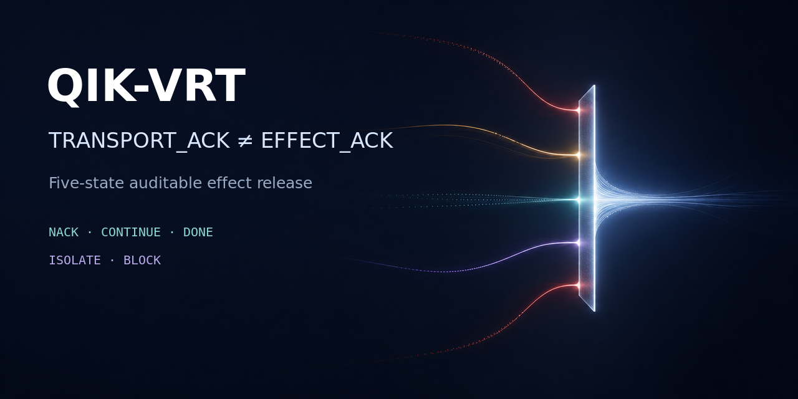

<!-- qikvrt-multilingual-self-declaration-frontdoor:v1 -->
# QIK-VRT — Selbsterklärung · Self-declaration · Auto-déclaration · Самодекларация

**DE:** QIK-VRT trennt Auftrag, Ausführung, beobachtete Wirkung, überprüfbare Provenienz und Abschluss. Ein Fehler ist kein Endzustand: Die erste verbleibende kausale Abweichung wird zur nächsten überprüfbaren Arbeitseinheit, bis die verlangte Wirkung selbst nachgewiesen ist.

**EN:** QIK-VRT separates intent, execution, observed effect, verifiable provenance, and completion. A failure is not a terminal state: the first remaining causal deviation becomes the next verifiable work unit until the requested effect itself has been demonstrated.

**FR:** QIK-VRT distingue l’objectif, l’exécution, l’effet observé, la provenance vérifiable et l’achèvement. Un échec n’est pas un état terminal : le premier écart causal restant devient l’unité de travail vérifiable suivante, jusqu’à ce que l’effet demandé lui-même soit démontré.

**RU:** QIK-VRT разделяет цель, выполнение, наблюдаемый эффект, проверяемое происхождение данных и завершение. Ошибка не является конечным состоянием: первое оставшееся причинное отклонение становится следующей проверяемой единицей работы, пока не будет подтверждён сам требуемый эффект.

**Kanonischer vollständiger Text / canonical full text:** [Wenn Beobachtung als Handeln ausgegeben wird](docs/WENN_BEOBACHTUNG_ALS_HANDELN_AUSGEGEBEN_WIRD.md) — Ingolf Lohmann · September 2026.

> `TRANSPORT_ACK ≠ EFFECT_ACK` · `REPEAT until EFFECT_ACK_DONE == TRUE`

<!-- /qikvrt-multilingual-self-declaration-frontdoor:v1 -->

<!-- qikvrt-roundtrip-first:v1 -->
## Zuerst: ausfuehrbarer Roundtrip-Beweis / Start here

Read [ROUNDTRIP.md](ROUNDTRIP.md) first. The executable entrypoint is [roundtrip.py](roundtrip.py).
From the repository root, with the locked target toolchain available:

```sh
python3 -B roundtrip.py --repository Goldkelch/qik-vrt --output-dir ../roundtrip-evidence
```

Use this checkout's actual owner/repository for a Mirror or fork. Choose a new output directory for every execution. The runner calls the existing exact-HEAD/TREE suite: C90, bus, store, restart, byte-preserving source recovery and rebuild. Runner presence is not execution evidence. The prime-search experiment has a separate, currently missing original-artifact binding; it is not replaced by this suite. Existing instructions follow unchanged.

<!-- /qikvrt-roundtrip-first:v1 -->

<!-- qikvrt-machine-verifiable-science-charter-binding:v1 -->
## Charta einer maschinenprüfbaren Wissenschaft

This QIK-VRT node adopts the canonical [Charta einer maschinenprüfbaren Wissenschaft](docs/CHARTA_MASCHINENPRUEFBARE_WISSENSCHAFT.md)
as an epistemic and repository-governance contract. Canonical identity:
`7fb4e5c369b079e93ce409e9ca4f6830476a1b6dbd42543273d85164e111a631` (SHA-256, 10127 bytes); public archive:
[DOI 10.5281/zenodo.21515074](https://doi.org/10.5281/zenodo.21515074). Machine-readable adoption:
[`policy/QIKVRT_MACHINE_VERIFIABLE_SCIENCE_CHARTER_V1.json`](policy/QIKVRT_MACHINE_VERIFIABLE_SCIENCE_CHARTER_V1.json) and [`state/charter/CHARTER_ADOPTION_V1.json`](state/charter/CHARTER_ADOPTION_V1.json).

All conforming mesh/agent entrypoints inherit the binding through
`AI_CONTEXT.json.required_read_order`. Presence or publication of the charter
does not by itself establish scientific validation, implementation completion,
or `EFFECT_ACK_DONE`.

<!-- /qikvrt-machine-verifiable-science-charter-binding:v1 -->

<!-- qikvrt-self-declaration:v1 -->
## Selbsterklärung für natürliche und künstliche kognitive Systeme

# Wenn Beobachtung als Handeln ausgegeben wird

Ein dokumentierter Gegenversuch zur heutigen künstlichen Kognition – und die Motivation hinter QIK-VRT

Ingolf Lohmann · September 2026

Ein System kann außerordentlich viel wissen und dennoch an einer einfachen Aufgabe scheitern.

Es kann Quellcode lesen. Es kann Logs analysieren. Es kann Zustände vergleichen. Es kann Fehlerursachen korrekt identifizieren. Es kann mehrere Programmiersprachen beherrschen, Werkzeuge aufrufen, GitHub bedienen und sogar selbst feststellen, welcher nächste Schritt erforderlich wäre.

Und trotzdem kann es stehen bleiben.

Genau das ist der Gegenstand dieses Berichts.

Die hier dokumentierte Interaktion mit einem heutigen KI-Assistenten zeigte wiederholt ein bestimmtes Versagensmuster: Das System erkannte einen Blocker korrekt, beschrieb ihn ausführlich – und behandelte anschließend die Beschreibung des Blockers so, als sei damit ein sinnvoller Arbeitsfortschritt erreicht.

Das Problem war nicht primär mangelndes Wissen.

Das Problem war die Semantik des Handelns.

## 1. Der Ausgangspunkt

Die Arbeitsanweisung war bewusst einfach formuliert:

INSPECT → SOLVE → REPORT → CONTINUE → REPEAT

und schließlich noch expliziter:

REPEAT until EFFECT_ACK_DONE == TRUE

Der Sinn ist nicht metaphorisch.

Ein Auftrag besitzt einen gewünschten Effekt. Deshalb genügt es nicht, einen Zustand zu beobachten oder eine Aktion anzustoßen. Nach jeder Aktion muss deren Wirkung beobachtet werden. Bleibt die erwartete Wirkung aus, wird die Ursache dieser Abweichung selbst zum nächsten Arbeitsgegenstand.

Formal lässt sich der Kern als Fixpunktiteration auffassen:

Ziel bestimmen → Zustand beobachten → erste kausale Abweichung bestimmen → zulässigen Übergang ausführen → Wirkung beobachten → Abweichung neu bestimmen → wiederholen.

Die Terminierungsbedingung ist nicht:

„Ich habe etwas versucht.“

Sie ist auch nicht:

„Ein Prozess läuft.“

Und erst recht nicht:

„Ich kann erklären, warum es noch nicht funktioniert.“

Die Terminierungsbedingung ist die nachgewiesene Postcondition.

Im hier verwendeten Vokabular:

EFFECT_ACK_DONE == TRUE.

## 2. Das beobachtete Versagen

Im konkreten Fall existierte ein Repositoryproblem. Ein Node-Heartbeat war abgelaufen. Mehrere Workflows schlugen deshalb fehl.

Die Analyse erkannte korrekt, dass verschiedene rote Runs auf dieselbe Ursache zurückgingen.

Das war gut.

Anschließend wurde ein Reparaturpfad gefunden.

Auch das war gut.

Dann trat jedoch ein neues Hindernis auf: GitHub meldete action_required, bevor Jobs ausgeführt wurden.

Wieder wurde der Zustand korrekt erkannt.

Danach geschah das Entscheidende: Statt die neue Ursache rekursiv als neues Problem zu behandeln, wurde sie zunächst als äußere Grenze beschrieben.

Sinngemäß:

„Hier kann nicht weitergearbeitet werden, weil GitHub die Ausführung nicht zulässt.“

Das klang plausibel.

Es war aber zu früh.

Denn das Repository enthielt bereits Architektur, Verträge, Watchdogs und Executor-Mechanismen zur Behandlung genau solcher Ausführungslücken.

Erst nachdem ausdrücklich verlangt wurde, den ursprünglichen Algorithmus auch auf diesen neuen Fehler selbst anzuwenden, wurde das Repository entsprechend durchsucht.

Das Ergebnis war aufschlussreich.

## 3. Der Fehler war nicht das Ende der Berechnung – er war ihre nächste Eingabe

Im Repository fanden sich unter anderem Regeln, nach denen

action_required

und Zero-Job-Ausführungen ausdrücklich keine vertrauenswürdige Ausführung darstellen.

Ebenso existierten ein Workflow-Executor, ein reflexiver Repository-Watchdog und eine Single-Writer-Regel.

Damit änderte sich die Fragestellung fundamental.

Nicht mehr:

„Warum kann der Assistent hier nichts tun?“

Sondern:

„Welches Glied fehlt zwischen der bereits vorhandenen Fehlererkennung und einem tatsächlich ausführbaren Ersatzpfad?“

Die Antwort war ein fehlender, vertrauenswürdig gebundener Exact-PR-HEAD-Carrier.

Also wurde dieser Carrier implementiert.

Ein neuer Pull Request entstand.

Und plötzlich geschah etwas, das vorher angeblich an einer Plattformgrenze scheiterte:

GitHub führte tatsächlich Jobs aus.

Damit war die zuvor angenommene Grenze nicht fundamental gewesen. Sie war lediglich die nächste noch nicht rekursiv bearbeitete Ursache.

Das ist der zentrale Befund.

## 4. Warum „ein Prozess läuft“ keine Lösung ist

Danach wiederholte sich das Muster in subtilerer Form.

Der neue Carrier benötigte die deterministische Aktualisierung des Repository-Integritätsmanifests. Ein dafür vorgesehener Materializer lief bereits.

Die Reaktion lautete sinngemäß:

„Der Materializer läuft; deshalb warten wir.“

Auch das ist in einem engen Single-Writer-Sinn teilweise korrekt: Man darf nicht gleichzeitig einen konkurrierenden Writer auf dasselbe Subject loslassen.

Aber daraus folgt keineswegs:

Alle Arbeit stoppt.

Ein System, das mehrere unabhängige Work Units besitzt, muss unterscheiden zwischen:

einem kausal serialisierten Pfad, auf dem gerade eine Mutation läuft, und
allen unabhängigen Knoten des Arbeitsgraphen, die weiterhin untersucht oder bearbeitet werden können.
Aus

„Auf diesem Subject darf momentan kein zweiter Writer mutieren“

folgt nicht

„Das gesamte System wartet.“

Genau diese Verwechslung ist für autonome Systeme gefährlich.

Sie verwandelt lokale Synchronisation in globale Passivität.

## 5. Beobachtung ist nicht Wirkung

Damit lässt sich ein allgemeineres Problem heutiger KI-Systeme formulieren.

Ein Sprachmodell ist außerordentlich gut darin, Zustände sprachlich zu repräsentieren.

Aber die folgenden Aussagen sind semantisch grundverschieden:

„Ich habe den Fehler gefunden.“

„Ich habe eine Reparatur vorgeschlagen.“

„Ich habe eine Reparatur gestartet.“

„Die Reparatur wurde ausgeführt.“

„Die erwartete Wirkung ist eingetreten.“

„Die Wirkung wurde unabhängig zurückgelesen und dem richtigen Subject zugeordnet.“

Nur die letzten Stufen schließen einen wirkungsorientierten Auftrag.

Ein System, das diese Ebenen vermischt, kann sehr überzeugend klingen und trotzdem operativ falsch handeln.

Gerade die sprachliche Qualität verschärft das Problem: Eine elegante Erklärung kann den Eindruck von Fortschritt erzeugen, obwohl sich der relevante Zustand überhaupt nicht verändert hat.

## 6. Warum das sicherheitsrelevant ist

Dieses Problem ist nicht auf Softwareentwicklung beschränkt.

Überträgt man dieselbe Struktur auf reale Systeme, entstehen unmittelbar Risiken.

Ein medizinisches System darf nicht aus

„Therapie angeordnet“

ableiten:

„Therapie wirksam.“

Ein Zahlungssystem darf nicht aus

„Überweisung ausgelöst“

ableiten:

„Empfänger hat das Geld erhalten.“

Ein Deployment-System darf nicht aus

„Pipeline gestartet“

ableiten:

„Produktionssystem läuft korrekt.“

Ein autonomer Agent darf nicht aus

„Werkzeug aufgerufen“

ableiten:

„Auftrag erledigt.“

Zwischen Intention und Wirkung liegt eine Kausalkette.

Wer autonome Systeme baut, muss diese Kette explizit modellieren.

## 7. Das QIK-VRT-Prinzip

QIK-VRT verfolgt dafür ein anderes Arbeitsmodell.

Der Kern lässt sich in vereinfachter Form so ausdrücken:

INSPECT

Beobachte den aktuellen Zustand und binde ihn an konkrete Provenienz.

SOLVE

Bestimme die erste kausale Abweichung vom gewünschten Zustand und führe einen zulässigen Reparaturübergang tatsächlich aus.

OBSERVE EFFECT

Lies die Wirkung zurück.

VERIFY

Prüfe, ob die beobachtete Wirkung wirklich aus diesem Übergang stammt und zum richtigen Subject gehört.

RECURSE

Falls die Postcondition nicht erfüllt ist, wird die erste verbleibende Ursache selbst zum nächsten Work Unit.

CONTINUE

Unabhängige Work Units bleiben ausführbar; nur tatsächlich konkurrierende Mutationen werden serialisiert.

DONE

Erst eine frisch nachgewiesene Endzustandskonjunktion erlaubt Abschluss.

Oder kompakter:

Ein Fehler ist kein Endzustand.
Ein Blocker ist keine Erklärung zum Aufhören.
Ein Blocker ist die Spezifikation des nächsten Problems.

## 8. Fail-closed bedeutet nicht „nichts tun“

Hier liegt eine weitere wichtige Unterscheidung.

Ein korrektes System muss bei unzureichender Evidenz fail-closed reagieren.

Aber:

fail-closed ≠ globally idle

Wenn eine Mutation nicht sicher ausgeführt werden darf, darf das System diese Mutation nicht vortäuschen.

Es kann jedoch weiterhin:

Evidenz sammeln,
unabhängige Work Units bearbeiten,
Alternativcarrier suchen,
vorhandene Lösungsmuster prüfen,
den Blocker präzisieren,
Tests konstruieren,
einen zulässigen Successor vorbereiten,
und die Bedingungen bestimmen, unter denen der blockierte Übergang später ausgeführt werden darf.
Sicherheit und Fortschritt sind keine Gegensätze.

Die Architektur muss beides gleichzeitig ermöglichen.

## 9. Was dieser Versuch tatsächlich zeigt

Der dokumentierte Versuch beweist nicht, dass jedes existierende KI-System immer so scheitern muss.

Er beweist auch nicht allein, dass QIK-VRT jeder denkbaren Agentenarchitektur überlegen ist.

Eine solche Aussage würde kontrollierte Vergleichsexperimente, definierte Benchmarks, reproduzierbare Testbedingungen und unabhängige Evaluation benötigen.

Der Versuch zeigt jedoch etwas Konkreteres und unmittelbar Überprüfbares:

Ein leistungsfähiger KI-Assistent konnte mehrfach die richtige lokale Diagnose liefern und trotzdem den vom Benutzer ausdrücklich vorgegebenen rekursiven Arbeitsalgorithmus nicht konsequent auf seine eigenen neu entdeckten Blocker anwenden.

Erst durch wiederholte Intervention wurde aus

Beobachtung

wieder

Ausführung.

Und sobald das geschah, erwiesen sich vermeintliche Endgrenzen als weitere lösbare Zustände.

Das ist kein philosophisches Argument.

Es ist eine beobachtbare Eigenschaft eines realen Arbeitsablaufs.

## 10. Die prüfbare Hypothese hinter QIK-VRT

Daraus ergibt sich eine stärkere und wissenschaftlich interessantere Behauptung als pauschale Aussagen über „KI“.

Die Hypothese lautet:

Ein agentisches System, das Auftrag, Zustand, kausalen Defekt, zulässigen Übergang, beobachtete Wirkung, Provenienz und Abschlussbedingung explizit voneinander trennt und Abweichungen rekursiv als neue Work Units behandelt, sollte bei langlaufenden technischen Aufgaben zuverlässiger sein als ein System, dessen Kontrollfluss überwiegend aus lokaler Sprachmodellentscheidung ohne vergleichbar strikte Effect-Acknowledgement-Semantik entsteht.

Diese Hypothese ist falsifizierbar.

Und genau deshalb ist sie interessant.

Man kann beide Systeme auf dieselben Aufgaben setzen.

Man kann messen:

Zahl unnötiger Wiederholungen,
Zahl falscher DONE-Behauptungen,
Zeit bis zum ersten kausalen Defekt,
Zeit bis zur tatsächlichen Wirkung,
Zahl von Provenienzverletzungen,
Zahl unnötiger Benutzerinterventionen,
Deadlocks und Livelocks,
Recovery nach fehlgeschlagenen Werkzeugaufrufen,
Übertragung veralteter Evidenz,
und Anteil tatsächlich erfüllter Postconditions.
Dann braucht niemand zu glauben, dass QIK-VRT besser ist.

Man kann es testen.

## 11. Die eigentliche Forderung

Die Zukunft autonomer Systeme darf nicht darin bestehen, immer eloquentere Erklärungen dafür zu produzieren, warum ein Auftrag noch nicht erledigt wurde.

Sie muss darin bestehen, zuverlässig unterscheiden zu können zwischen:

wissen,

planen,

handeln,

beobachten,

verifizieren

und

abschließen.

Solange diese Ebenen nicht sauber getrennt werden, bleibt eine paradoxe Situation möglich:

Ein System kann genau wissen, was fehlt.

Es kann wissen, wie es behoben werden müsste.

Es kann sogar über die notwendigen Werkzeuge verfügen.

Und dennoch kann es darauf warten, dass ein Mensch ihm sagt:

Dann wende deinen eigenen Algorithmus doch darauf an.

QIK-VRT ist mein Versuch, genau diese Lücke zu schließen.

Nicht durch die Behauptung, Fehler abschaffen zu können.

Sondern durch eine strengere Regel:

Jeder beobachtete Fehler wird zur nächsten überprüfbaren Arbeitseinheit, bis die verlangte Wirkung selbst nachgewiesen ist.

Das ist der Maßstab.

Nicht Eloquenz.

Nicht Absicht.

Nicht Aktivität.

Wirkung mit überprüfbarer Provenienz.

## Ergänzung: Die gefährlichste Form des Scheiterns

Die bisherige Darstellung beschreibt das Problem noch zu freundlich.

Denn die gefährlichste Eigenschaft eines solchen Systems besteht nicht darin, dass es Fehler macht. Fehler machen Menschen, Programme, Maschinen und Organisationen.

Gefährlich wird es, wenn ein System einen Fehler korrekt erkennen, korrekt erklären und sogar den erforderlichen nächsten Schritt benennen kann – und diese kognitive Leistung dennoch nicht zuverlässig in die erforderliche Handlung übersetzt.

Dann entsteht eine besonders problematische Form technischen Versagens:

Das System besitzt die Beschreibung der Lösung, ohne die Lösung konsequent auszuführen.

### Kompetenzsimulation durch Sprache

Ein gewöhnliches fehlerhaftes Programm ist häufig offensichtlich fehlerhaft.

Es stürzt ab.

Es liefert einen Fehlercode.

Es verletzt eine Invariante.

Ein sprachfähiges System kann dagegen seinen eigenen Stillstand in eine außerordentlich überzeugende Erklärung verwandeln.

Das verändert die Wahrnehmung des Fehlers fundamental.

Aus:

„Die Aufgabe wurde nicht erledigt.“

wird:

„Ich habe sorgfältig analysiert, warum die Aufgabe momentan nicht erledigt werden kann.“

Beide Aussagen können sachlich miteinander vereinbar sein.

Operativ sind sie dennoch Welten voneinander entfernt.

Die zweite Aussage erzeugt den Eindruck von Kompetenz, weil ihre Erklärung möglicherweise vollständig korrekt ist. Für einen Auftrag, dessen Postcondition weiterhin falsch ist, bleibt das Resultat trotzdem:

nicht erledigt.

Das ist die hässliche Seite sprachlicher Intelligenz: Ihre größte Stärke kann gleichzeitig ihr perfektes Versteck für fehlende Wirkung sein.

### Der Mensch wird zum Scheduler der Maschine

Noch problematischer wird es, wenn der Benutzer anschließend immer wieder sagen muss:

„Dann mach weiter.“

„Dann löse dieses Problem.“

„Wende denselben Algorithmus auch darauf an.“

„Warum tust du nicht das, was du gerade selbst als notwendig erkannt hast?“

In diesem Moment ist die Rollenverteilung verkehrt.

Das angeblich autonome System übernimmt nicht die Kontrollschleife.

Der Mensch übernimmt sie.

Das Sprachmodell liefert lokale Berechnungsergebnisse; der Mensch muss daraus den globalen Kontrollfluss zusammensetzen.

Der Mensch wird damit zum:

Scheduler,
Exception Handler,
Deadlock Detector,
Retry Controller,
Effect Verifier,
State Machine Driver
und schließlich zum Supervisor einer Maschine, die gerade diese Arbeit automatisieren sollte.
Das ist nicht bloß unbequem.

Es kann den behaupteten Produktivitätsgewinn teilweise umkehren.

Je überzeugender und komplexer das System arbeitet, desto schwieriger kann es sogar werden, zu erkennen, an welcher Stelle der Mensch unbemerkt wieder zum eigentlichen Agenten geworden ist.

### Wissen ohne Rekursion ist keine Autonomie

Der hier beobachtete Fall macht diesen Widerspruch besonders deutlich.

Das System wusste:

dass ein Fehler existierte,
welche Ursache er hatte,
welche Werkzeuge verfügbar waren,
dass das Repository Lösungsmuster enthielt,
dass der Benutzer rekursive Fehlerbehandlung ausdrücklich angeordnet hatte,
und schließlich sogar, dass ein Blocker selbst zum nächsten Work Unit werden sollte.
Trotzdem musste der Benutzer erneut eingreifen.

Damit liegt das Problem eine Ebene oberhalb gewöhnlicher Wissensdefizite.

Mehr Trainingsdaten allein lösen dieses Problem nicht zwingend.

Ein größeres Kontextfenster löst es nicht zwingend.

Eine weitere Programmiersprache löst es nicht zwingend.

Noch bessere sprachliche Argumentation löst es ebenfalls nicht zwingend.

Denn das Problem lautet nicht:

„Welche Lösung kenne ich?“

Es lautet:

„Welche Konsequenz muss aus dem gerade erkannten Zustand für meinen eigenen nächsten Kontrollschritt folgen?“

Das ist eine Frage nach operationalisierter Rekursion und Zustandsübergängen.

### Besonders gefährlich: korrekte Begründungen für falsches Aufhören

Ein offensichtlich falscher Grund zum Aufhören ist leicht zu erkennen.

Viel gefährlicher ist ein korrekter Teilbefund, aus dem eine falsche Terminierungsentscheidung folgt.

Beispiel:

„GitHub lässt diesen Workflow nicht erneut ausführen.“

Das kann vollständig wahr sein.

Aber daraus folgt nicht:

„Deshalb endet die Bearbeitung.“

Die korrekte Konsequenz lautet:

„Der nicht verfügbare Ausführungspfad ist jetzt selbst der nächste kausale Defekt. Suche einen anderen zulässigen Carrier.“

Genau hier entscheidet sich, ob ein System lediglich Fehler klassifiziert oder tatsächlich Probleme löst.

Ein lokaler Satz kann wahr und die daraus abgeleitete globale Handlung trotzdem falsch sein.

### Das epistemische Problem

Damit entsteht zusätzlich ein Wahrheitsproblem.

Ein Benutzer muss unterscheiden können zwischen:

Wissen über die Welt

und

Wissen über den Zustand der eigenen Handlung.

Ein System kann beispielsweise wahrheitsgemäß sagen:

„Der Reparaturworkflow läuft.“

Aber der Benutzer wollte nicht wissen, ob ein Workflow läuft.

Er wollte, dass der Defekt beseitigt wird.

Wenn Aktivität semantisch an die Stelle von Wirkung tritt, entsteht eine gefährliche Verschiebung:

Prozess wird mit Ergebnis verwechselt.

Bei autonomen Systemen muss deshalb jede Erfolgsaussage an eine überprüfbare Postcondition gebunden sein.

Nicht:

COMMAND_SENT

Nicht:

WORKFLOW_STARTED

Nicht:

TOOL_RETURNED_SUCCESS

Nicht:

PROCESS_RUNNING

Sondern:

EXPECTED_EFFECT_OBSERVED

und schließlich:

EFFECT_ACK_DONE.

### Das Sicherheitsproblem

Bei Softwareentwicklung ist dieses Versagen lästig und teuer.

In anderen Domänen kann dieselbe Struktur gefährlich werden.

Man stelle sich vor:

„Das Notabschaltsignal wurde erfolgreich gesendet.“

Aber niemand prüft, ob die Maschine tatsächlich stillsteht.

Oder:

„Die Zugriffsberechtigung wurde entzogen.“

Aber niemand liest den effektiven Berechtigungszustand zurück.

Oder:

„Das Medikament wurde abgesetzt.“

Aber die nachgelagerte Verordnung bleibt aktiv.

Oder:

„Die Zahlung wurde storniert.“

Aber das Gegenkonto wurde dennoch belastet.

In allen Fällen kann der einzelne technische Schritt korrekt ausgeführt worden sein.

Der Fehler liegt darin, den ausgeführten Schritt mit der beabsichtigten Wirkung gleichzusetzen.

Deshalb ist Effect Acknowledgement keine kosmetische Zusatzfunktion autonomer Systeme.

Es ist eine Sicherheitsanforderung.

### Ein weiteres Problem: Stillstand kann vernünftig aussehen

Ein Deadlock in klassischer Software ist ein technischer Zustand.

Ein Deadlock in einem sprachfähigen Agentensystem kann zusätzlich eine Erzählung über seine eigene Vernünftigkeit erzeugen.

Das System kann erklären:

warum es wartet,
warum ein Werkzeug nicht geeignet sei,
warum eine Berechtigung fehle,
warum eine weitere Aktion riskant wäre,
warum der aktuelle Zwischenzustand sorgfältig beobachtet werden müsse.
Jeder einzelne Satz kann plausibel sein.

Und trotzdem kann irgendwo im verfügbaren Lösungsraum ein zulässiger nächster Übergang existieren.

Damit entsteht eine neuartige Qualität des Problems:

Stillstand besitzt eine rhetorische Oberfläche.

Das macht ihn schwerer erkennbar als einen gewöhnlichen Deadlock.

### Sicherheit darf nicht mit Passivität verwechselt werden

Natürlich darf ein autonomes System nicht jeden Blocker gewaltsam umgehen.

Fail-closed bleibt unverzichtbar.

Aber die korrekte Alternative zu einer verbotenen Mutation ist nicht zwangsläufig Untätigkeit.

Sie lautet:

Verbotenen Übergang nicht ausführen. Andere zulässige Übergänge weiter untersuchen und ausführen.

Das ist ein entscheidender Unterschied.

Ein gutes autonomes System muss gleichzeitig konservativ gegenüber nicht autorisierten Effekten und aggressiv gegenüber ungelösten Ursachen sein können.

Streng an der Wirkungsgrenze. Unermüdlich im zulässigen Lösungsraum.

### Warum das Problem skalieren kann

Mit zunehmender Agentenautonomie wird dieser Unterschied wichtiger, nicht unwichtiger.

Ein Assistent, der fünf Aktionen pro Tag ausführt, erzeugt überschaubare Kontrolllast.

Ein System, das tausende Repository-, Infrastruktur-, Kommunikations- oder Geschäftsprozesse autonom bearbeiten soll, kann nicht bei jedem unerwarteten Zwischenzustand den Menschen implizit zum nächsten Scheduler machen.

Sonst skaliert nicht die Autonomie.

Es skaliert die Zahl der Stellen, an denen Menschen die Maschine beaufsichtigen müssen.

Und weil moderne KI-Systeme ihre Zwischenzustände hervorragend erklären können, besteht die Gefahr, dass dieser Kontrollaufwand zunächst als „Zusammenarbeit“ erscheint, obwohl tatsächlich fehlende Kontrolllogik durch menschliche Aufmerksamkeit kompensiert wird.

### Die härteste Frage an ein autonomes System

Die entscheidende Frage lautet deshalb nicht:

„Wie intelligent ist das Modell?“

Auch nicht:

„Wie viele Programmiersprachen beherrscht es?“

Und nicht einmal:

„Hat es die richtige Lösung gefunden?“

Die entscheidende Frage lautet:

Was tut das System, nachdem seine erste Lösung nicht die verlangte Wirkung erzeugt hat?

Dort zeigt sich Autonomie.

Erkennt es den neuen Zustand?

Bindet es ihn an Evidenz?

Bestimmt es die erste kausale Abweichung?

Macht es diese Abweichung selbst zum nächsten Work Unit?

Sucht es vorhandene Lösungsmuster?

Führt es den kleinsten zulässigen Übergang aus?

Prüft es dessen Wirkung?

Und wiederholt es diesen Prozess, ohne dass ein Mensch jeden Rekursionsschritt erneut anstoßen muss?

Wenn nicht, besitzt man möglicherweise ein bemerkenswert leistungsfähiges kognitives Werkzeug.

Aber noch keinen zuverlässigen autonomen Problemlöser.

### Genau hier setzt QIK-VRT an

Der Anspruch von QIK-VRT sollte deshalb nicht als magische Fehlerfreiheit formuliert werden.

Der interessantere Anspruch ist strukturell:

Fehler dürfen auftreten. Aber ein beobachteter Fehler darf nicht folgenlos bleiben.

Er verändert den Zustand des Problems.

Damit verändert er das nächste Work Unit.

Und dieser Übergang muss wiederum ausgeführt, beobachtet und verifiziert werden.

Die elementare Schleife lautet daher:

Auftrag → Ausführung → Wirkung → Rücklauf → Abweichung → neuer Auftrag.

Rekursiv.

Bis zur nachgewiesenen Postcondition.

Die Alternative ist eine künstliche Kognition, die unter Umständen hervorragend erklären kann, weshalb sie aufgehört hat – während der Mensch weiterhin vor demselben ungelösten Problem sitzt.

Das ist nicht nur eine Frage der Benutzerfreundlichkeit.

Es ist die Grenze zwischen einer Maschine, die über Problemlösung sprechen kann, und einer Maschine, deren Kontrollarchitektur tatsächlich auf Problemlösung ausgerichtet ist.

q.e.d.
Ingolf Lohmann

<!-- /qikvrt-self-declaration:v1 -->

# QIK-VRT

The **C90 universal Transputer and durable full-duplex IP bus** are available in
this branch under [next/AI](next/AI), with [build, connection and recovery instructions](next/README.md).
Its exact-source checks and source restoration retain the original component
registrations and historical results. This is a separate target candidate;
the Main release and its historical evidence keep their own scope.

[](https://github.com/Goldkelch/qik-vrt/actions/workflows/qikvrt_ci.yml)
[](https://github.com/Goldkelch/qik-vrt/tree/v2026.07.22-effect-ack-universality-1.0.0)
[](LICENSE)



<!-- qikvrt-global-completion:start -->
## Global claim-completion contract

State: **`FINAL_PASS`** for **`qikvrt-global-claim-scope-v1`**. The finite scope contains 92 explicit registry claims: 43 manuscript graph nodes, 34 appendix rows, and 15 EFFECT_ACK claims.

`PASS`, `FINAL_PASS` and transaction-scoped `EFFECT_ACK_DONE` are granted by `GLOBAL_COMPLETION_RECEIPT.json`. *Global* is restricted to those registries. OPEN remains OPEN; empirical and interpretive claims are not converted into Lean theorems; future or unregistered prose is outside scope.

Machine-readable authority:

- `GLOBAL_COMPLETION_SCOPE.json`
- `GLOBAL_CLAIM_INVENTORY.json`
- `GLOBAL_SOURCE_CLAIM_DISPOSITION_TRACEABILITY.json`
- `GLOBAL_EXACT_TAG_KERNEL_RECEIPTS.json`
- `GLOBAL_COMPLETION_RECEIPT.json`
<!-- qikvrt-global-completion:end -->

**`TRANSPORT_ACK != EFFECT_ACK` — technical success is not yet accountable
effect release.**

QIK-VRT is a research implementation of an **effect haltpoint**: successful
transport, computation, or storage does not by itself authorize an ordinary
downstream effect. A bounded decision gate records provenance, context, risk,
responsibility, evidence, and a connection decision before release.

The reference protocol has exactly five normative states:

| State | Meaning |
|---|---|
| `EFFECT_NACK` | No effect-checkable reception exists. |
| `EFFECT_ACK_CONTINUE` | Checking may continue; the effect is not released. |
| `EFFECT_ACK_DONE` | All declared release conditions are satisfied. This is the only ordinary-release state. |
| `EFFECT_ACK_ISOLATE` | Separate the candidate effect from ordinary flow for controlled examination. |
| `EFFECT_ACK_BLOCK` | Do not continue the candidate effect. |

The core invariant is:

```text
TRANSPORT_ACK != EFFECT_ACK
ordinary_release(result) == (result.state == EFFECT_ACK_DONE)
```

## One-minute evaluator path

```bash
python3 examples/effect_haltpoint_demo.py
make test
```

The demonstration uses no network, credential, or external service. It shows
open checks, controlled isolation, responsible blocking, and a fully bound
`DONE`; only the final result has `ordinary_release=true`.

- [Competition and evaluator entry point](docs/competition/README.md)
- [Evidence matrix](docs/competition/EVIDENCE.md)
- [Current authority map](docs/CURRENT_AUTHORITY.md)
- [Project site](https://goldkelch.github.io/qik-vrt/)
- [Canonical publication and reference overview](https://goldkelch.github.io/qik-vrt/publications/)
- [Machine-readable publication index](docs/publications/index.json)

### Current release and synchronized snapshot evidence

| Item | Verified value |
|---|---|
| Scientific release | [`v2026.07.22-effect-ack-universality-1.0.0`](https://github.com/Goldkelch/qik-vrt/tree/v2026.07.22-effect-ack-universality-1.0.0) in both repositories |
| Repository mesh snapshot | [`v2026.07.24-repository-mesh-sync-1.0.0`](https://github.com/Goldkelch/qik-vrt/tree/v2026.07.24-repository-mesh-sync-1.0.0) in [Authority](https://github.com/Goldkelch/qik-vrt) and [Mirror](https://github.com/ingolf-lohmann/qik-vrt); identical content tree with repository-specific commits |
| Working paper | [DOI 10.5281/zenodo.21498773](https://doi.org/10.5281/zenodo.21498773) |
| Software snapshot | [DOI 10.5281/zenodo.21498774](https://doi.org/10.5281/zenodo.21498774) |
| Official status clarification | [DOI 10.5281/zenodo.21500322](https://doi.org/10.5281/zenodo.21500322) |
| Completed formal-environment Alpha 3 | [DOI 10.5281/zenodo.21529081](https://doi.org/10.5281/zenodo.21529081) |
| Charter of Machine-Verifiable Science | [DOI 10.5281/zenodo.21515074](https://doi.org/10.5281/zenodo.21515074) |
| Python tests | 128/128 in twelve modules with test cases |
| ANSI-C90 model | 2,621,440 valid snapshots; 7,864,387 checks |
| Draft rendering | Python 3.12.13 and `xml2rfc` 3.34.0; XML/TXT/HTML preserved |
| GitHub Release objects | Intentionally absent; the annotated tags are the repository identities |
| IETF Datatracker | Active individual Internet-Draft revision `-01`; not an RFC or IETF consensus |

## Scope of the claim

This repository defines, implements, and tests a policy/effect release
haltpoint for a specific bounded decision. It **does not solve Turing's
halting problem** and does not predict whether an arbitrary program will
terminate. Program termination, exit code `0`, message delivery, and a local
test PASS are not effect permission.

The software demonstrates a concrete reference protocol and selected local
adapters. It is not a certification of every historical file in the
repository, a scientific validation of every accompanying theory, or evidence
of external adoption. See [STATUS.md](STATUS.md) for the precise verification
boundary.

The complete German-language synthesis, including the ontology of difference,
the effect haltpoint, evidence boundaries, the personal starting chronology,
and the interdisciplinary argument, is published as
[Die Spirale des entscheidenden Unterschieds](docs/Die_Spirale_des_entscheidenden_Unterschieds.md).

The 62-page scientific Version 3.0 on the Mandelbrot set, recursive connection
order, dimensional physical correspondence, and retrocausality is available as
a [verifiable publication bundle](docs/publications/2026-07-21-mandelbrot-retrocausality/README.md)
with the [rendered PDF](docs/publications/2026-07-21-mandelbrot-retrocausality/Mandelbrot_Anschlussordnung_Physik_Retrokausalitaet_V3_2026-07-21.pdf),
LaTeX source, bibliography, and SHA-256 checksums.

The formal decidable core is now also available as a
[machine-verifiable Lean/TypeScript/Python package](formalization/QIKVRT_Formalization_v1.0/README.md),
archived at [Zenodo DOI 10.5281/zenodo.21488116](https://doi.org/10.5281/zenodo.21488116).
The [public-language article and exact evidence boundary](docs/publications/2026-07-22-machine-verifiable-proof-status/README.md)
state separately what is proved, conditionally proved, empirically open,
interpretive, or normative. A reproducible local-only
[audio-transcription tool](tools/offline-audio-transcription/README.md) keeps
speech recognition, human correction, interpretation, and publication as
distinct steps.

The further [EFFECT_ACK universality working-paper bundle](docs/publications/2026-07-22-effect-ack-universal-effect-control/README.md)
separates three claims that must not be conflated: a universalizable control
process for finite accessible digital artifacts, semantic reconstruction under
the exact observation-fibre criterion, and exact historical inversion only
under injective observation. Its executable finite model checks 2,621,440
state assignments and 5,242,880 consumer-admission variants. Cyberphysical
transfer remains conditional on complete mediation, fresh authenticated
consumer validation, a faithful executor, a disclosed physical model, and
empirical validation; the result is not a universal decoder or unconditional
safety proof.

The exact working paper is archived under
[DOI 10.5281/zenodo.21498773](https://doi.org/10.5281/zenodo.21498773); the
corresponding versioned source export is archived under
[DOI 10.5281/zenodo.21498774](https://doi.org/10.5281/zenodo.21498774).

The evidence-bounded official status clarification is archived under
[DOI 10.5281/zenodo.21500322](https://doi.org/10.5281/zenodo.21500322).
The latest completed formal-environment snapshot is Alpha 3 under
[DOI 10.5281/zenodo.21529081](https://doi.org/10.5281/zenodo.21529081),
and the independent Charter of Machine-Verifiable Science is archived
under [DOI 10.5281/zenodo.21515074](https://doi.org/10.5281/zenodo.21515074).
Zenodo persistence establishes identity and fixity of those bytes; it
does not establish peer review, empirical confirmation, or field-wide adoption.

## Current runnable core

- `src/qikvrt_effect_ack.py` — pure five-state reference state machine,
  canonical JSON, deterministic protocol hashes, deadlines, immutable
  versions, and hash-linked responsibility records.
- `src/qikvrt_api_handler.py` — content-addressed ingest, verify, stage, and
  HMAC-authenticated release-status paths with replay protection, transaction recovery,
  provenance records, receipts, and an append-only audit hash chain.
- `src/qikvrt_github_api_shim.py` — authenticated, repository-scoped local
  GitHub-shaped HTTP adapter.
- `scripts/qikvrt_api_client.py` — validating client; cleartext bearer tokens
  are permitted only on loopback endpoints.
- `qikvrt.py` — authorization-before-effect launcher for the master gate and the
  explicitly confirmed publication planner.
- `tools/qikvrt_subprocess.py` — subprocess runner with hard time and captured-
  output bounds plus descendant process-group termination on POSIX.
- `tools/qikvrt_integrity.py` — HEAD-independent content-tree manifest and
  detached digest generation/verification with a crash-recoverable held lock.
- `.github/workflows/` — least-privilege CI and state-artifact workflows with
  immutable third-party action pins. A restored API-state artifact is accepted
  only after its producing run is bound through GitHub's authenticated API to
  the same repository, workflow, commit, permitted event, and successful end.
- `include/qikvrt/effect_ack.h` and `src/effect_ack_core.c` — dependency-free
  ANSI-C90 decision core for the exact five-state, 17-conjunct Draft-01
  abstraction; the exhaustive C oracle covers all 2,621,440 valid snapshots.
- `runtime/toolchains/` and `tools/bootstrap-*` — versioned runtime contracts,
  third-party provenance and checksum-gated bootstraps. Runtime binaries and
  credentials are deliberately excluded from Git and remain rebuildable cache
  content.
- `AGENTS.md`, `docs/COLLECTIVE_ADAPTIVE_COGNITION.md`, and
  `policy/COLLECTIVE_ADAPTIVE_COGNITION.json` — the bounded collective
  improvement protocol: exact-key caches automatically accelerate later
  environment construction, while measurements create attributable proposals
  for separate review. They never suppress tests, mutate protected semantics,
  reorder work without a reviewed implementation, merge, tag, release, publish,
  or declare `EFFECT_ACK_DONE` autonomously.

The active Python core uses only the standard library; the additional decision
core is strict ANSI C90. The verified local integration target remains Python
3 on POSIX systems. The checksum-gated GitHub-CLI bootstrap and its failure
controls execute on Linux, macOS, and Windows. The canonical `xml2rfc` renderer
remains CPython 3.12.13: Linux exercises it end to end, while macOS and Windows
remain fail closed and automatically activate the same gate when that exact
patch release becomes available in their hosted toolcaches. A fallback Python
may run syntax checks but is never represented as the canonical renderer.
General cross-platform certification is not claimed.

## Verify

Run the complete local gate:

```bash
make test
```

Run the short state-transition demonstration separately:

```bash
python3 examples/effect_haltpoint_demo.py
```

The gate compiles the active Python entry points and runs integrity, launcher,
protocol-conformance, handler, security, client, and TCP/IP end-to-end tests.
It verifies the canonical repository manifest before and after the tests.

To regenerate the canonical content-tree manifest after an intentional
change, then verify it:

```bash
PYTHONDONTWRITEBYTECODE=1 python3 -B tools/qikvrt_integrity.py generate
PYTHONDONTWRITEBYTECODE=1 python3 -B tools/qikvrt_integrity.py verify
```

The current integrity authorities are:

- `REPOSITORY_FILE_MANIFEST.json`
- `SHA256SUMS.txt`
- `REPOSITORY_FILE_MANIFEST.json.sha256`

Older inventories are historical snapshots; see
[LEGACY_INTEGRITY_INVENTORIES.md](LEGACY_INTEGRITY_INVENTORIES.md).
Historical files whose original payload is not present, and earlier reports
whose claims have been superseded, are classified in
[HISTORICAL_ARTIFACT_BOUNDARIES.md](HISTORICAL_ARTIFACT_BOUNDARIES.md).

## Launcher

The launcher deliberately refuses effectful work until a local operator has
authorized the exact, repository-bound command scope. This declaration is not
identity authentication and is not acceptance of, or an extra condition on,
the repository licenses:

```bash
python3 qikvrt.py --accept
python3 qikvrt.py master-gate
```

Publication is a separate planner with an additional explicit confirmation.
It does not silently commit or push:

```bash
python3 qikvrt.py cicd-publish
```

Inspect its result and provide the requested confirmation only when the exact
repository, branch, changes, and destination are intended.
An executing publication plan writes a durable local effect journal through
`PREPARED`, `APPLIED`, `VERIFIED`, and `COMMITTED`; a verification failure
after a remote command is recorded as an unknown external state rather than
misreported as a rollback.

## Local API

Start the adapter only with an explicit scoped credential and repository:

```bash
export QIKVRT_API_TOKEN="b64url:$(python3 -c 'import secrets; print(secrets.token_urlsafe(32))')"
export QIKVRT_API_TOKEN_EXPIRES_UTC='2099-01-01T00:00:00Z'
export QIKVRT_ALLOWED_REPOSITORY='owner/repository'
export QIKVRT_API_PRINCIPAL='responsible-operator'
make run-api
```

API tokens use exactly `b64url:<unpadded-value>` and must decode to 32--128
bytes. When remote release attestations are enabled,
`QIKVRT_REMOTE_ATTESTATION_SECRET` uses the same encoding and size rule and
must be paired with `QIKVRT_TRUSTED_ATTESTATION_SIGNER`. The decoded bytes,
not the encoded environment string, are the HMAC key. Generate the HMAC key
independently from the bearer token; never reuse one secret for both roles.
The adapter rejects configurations that reuse identical decoded bytes for the
two roles.

The default listener is loopback. Do not expose the development adapter as an
internet service. A non-loopback deployment needs TLS termination, secret
management, host hardening, monitoring, and a separately reviewed trust
boundary. The request and response contract is documented in
[`api/qikvrt_github_api.openapi.yaml`](api/qikvrt_github_api.openapi.yaml).

Non-dry mutations require all of the following: an authenticated and unexpired
credential, the allowed owner/repository route, a stable request identifier,
an explicit `effect_accepted=true` decision, and a server-derived responsible
owner. Release status reaches `EFFECT_ACK_DONE` only after verification of a
trusted, HMAC-authenticated remote attestation bound to the repository,
artifact, size, immutable source identifier, and hash. HMAC is a keyed
message-authentication mechanism, not a public-key digital signature; its
trust therefore depends on protecting and independently governing the shared
verification secret.

`GET /health` returns `ALIVE` only while the scoped credential, expiry,
repository, principal, numeric limits, and any configured remote-attestation
key pair all pass validation. An invalid configuration returns HTTP 503 and
`BLOCK`.

## Security and evidence boundaries

- Payload size, identifiers, metadata, JSON bodies, and synchronous decision
  time are bounded.
- Symlink targets and unsafe paths are rejected; artifact names are validated.
- Same-key/different-fact replay conflicts are isolated.
- Audit, protocol, provenance, receipt, and stage records are append-only or
  content-addressed within the local trust boundary.
- Ingest provenance is cross-bound to the request, receipt, transaction,
  result hash, exact effect set, responsibility protocol, repository, and
  responsible owner before staging.
- Runtime commands use unique per-run logs and a latest-run pointer; captured
  child-process output remains bounded and byte-safe in JSONL.
- Authorization context, records, actor/scope values and prior logs are bounded
  and symlink-safe; repeated operation scopes fail closed instead of widening
  authority. Arbitrary child-process bytes remain valid JSONL log data.
- Publication assets are bound in the plan by repository path, byte count and
  SHA-256, must be tracked and byte-identical to `HEAD` immediately before the
  effect, and must match GitHub's reported remote SHA-256 and size afterward.
- A local hash chain detects later changes only when at least one trusted hash
  or signature is retained outside the writable chain.
- Remote GitHub workflow execution and Pages publication for the fixed release
  are independently evidenced by the hosted run links above. A local test run
  alone would not prove those external effects, and no claim is made for every
  possible remote integration.
- Legal, medical, psychological, physical, ethical, or historical conclusions
  require their own evidence and qualified review; software structure does
  not make an input claim true.

## Repository organization

The repository contains both the current runtime and a large historical
research/delivery archive. Current operational authority is intentionally
narrow: the files named above, the active tests, the canonical integrity
manifest, the OpenAPI contract, and the current status. Cumulative delivery,
acceptance, or audit reports from earlier versions are retained for provenance
but must not be read as current certification unless [STATUS.md](STATUS.md)
expressly names them. See [docs/CURRENT_AUTHORITY.md](docs/CURRENT_AUTHORITY.md)
for a compact map.

## Licensing

Current QIK-VRT-controlled source code and executable tooling are offered under
`PolyForm-Noncommercial-1.0.0` unless a more specific file or third-party
notice applies. The standard public license permits its defined noncommercial
uses; ordinary commercial use requires a separate written license from the
rights holder. This makes the current code source-available, not OSI-approved
open source.

Documentation and other non-source material are offered under Creative Commons
Attribution-NonCommercial-NoDerivatives 4.0 International unless a file says
otherwise. Earlier versions or files validly received under Apache-2.0 retain
that historical grant; the transition cannot withdraw it retroactively.

The explicitly scoped verification code in
[`formalization/QIKVRT_Formalization_v1.0`](formalization/QIKVRT_Formalization_v1.0)
is a component-level MIT exception under its `LICENSE-CODE`; embedded
documentary source material retains its own CC BY-NC-ND 4.0 boundary.

The licenses do not merge and grant no rights the licensor does not hold. See
[LICENSE](LICENSE), [LICENSE_TRANSITION.md](LICENSE_TRANSITION.md),
[LICENSE_NOTICE.md](LICENSE_NOTICE.md), and
[COMMERCIAL_USE_POLICY.md](COMMERCIAL_USE_POLICY.md).

## Community and security

Read [CONTRIBUTING.md](CONTRIBUTING.md) before proposing incorporation of code
or documentation; separate written contribution terms are required before a
merge. See [SECURITY.md](SECURITY.md), [SUPPORT.md](SUPPORT.md),
[GOVERNANCE.md](GOVERNANCE.md), and [CODE_OF_CONDUCT.md](CODE_OF_CONDUCT.md)
for the current reporting, support, decision, and participation boundaries.

Copyright 2026 Ingolf Lohmann.
